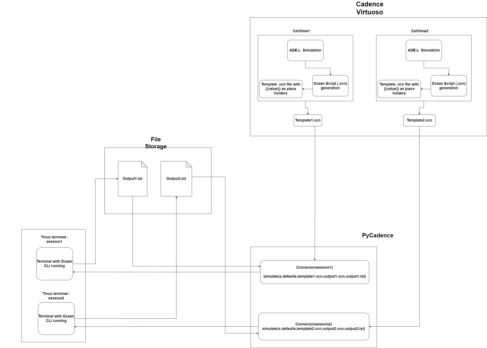

# PyCadence
 A Python wrapper for running Cadence simulations

## Pre-requisites
- OS: Linux/Unix based OS
- Python 3.6 or higher
- IC615 or higher (Cadence Virtuoso) to be installed on the device with Ocean Spectre enabled
- tmux to be installed on the device
  
    To install tmux on Ubuntu/Debian based systems, run the following command
    ```shell
    sudo apt-get install tmux
    ```
    
    To install tmux on RedHat/CentOS based systems, run the following command
    ```shell
    sudo yum install tmux
    ```

## Installation
1. Install PyCadence using pip
```pip install CadenceConnector```

Add the --user option if you don't want to install it systemwide.


## Usage
1. Make sure to have a template init.ocn file ready
2. In the ocn file placeholder values must be marked as {{value}} as shown in the sample init.ocn file placed in the sample folder
3. Go to the directory where the init.ocn file is placed and enable the Cadence environment using the following shell command
```shell
    csh
    source /home/install/cshrc # Path to the cshrc file in the Cadence installation directory
```
Next, create a new tmux session using the following shell command

```shell
tmux new-session -s <session name>
```
4. Install and enable ocean terminal using the following shell commands
```shell
ocean
```
Now, The terminal can be detached or left running in the background. To detach the terminal, press Ctrl+b and then press d.

6. Now, create a python script and use the following code to run the simulation

```python
from pycadence.pycadence import Connector
x = [1,2,3,4,5] # List of values to be substituted in the template .ocn file
default = [1,2,3,4,5] # List of default values to be substituted in the template in case no value is provided
p=Connector(screen_name=<session name>)
p.simulate(x, default,"init.ocn","output.ocn","output.txt")
```
7. The result of simulation will be stored output.txt file and the output.ocn file will be the modified template file with the values substituted.
8. The simulate function also has an argument called `read_output` which takes a function as an argument. This function will be called after the simulation is complete and the output.txt file is generated. The function should take the output.txt file as an argument and return a Iterable of the values parsed from the output.txt file. The following code demonstrates how to use the `read_output` argument.

```python
from pycadence.pycadence import Connector
import numpy as np

def read_output(output_log_path):
    with open(output_log_path, 'r+') as fp:
        # read an store all lines into list
        lines = fp.readlines()
        data=[]
        for line in lines[2:]:
            try:
                temp = line.strip().split(" ")
                # print(temp)
                data.append([float(temp[0]),float(temp[-1])])
            except Exception as e:
                # print("Error in reading output file")
                # print(e)
                pass
        data = np.array(data)
    return data

p=Connector(screen_name="ocean_simulation")
x = [1,2,3,4,5] # List of values to be substituted in the template
default = [1,2,3,4,5] # List of default values to be substituted in the template in case of error
p.simulate(x, default,"init.ocn","output.ocn","output.txt",read_output)
```
9. The above code will read the output.txt file and return a numpy array of the values.

10. Refer to the init.ocn file in the sample folder for the template file format.


## Examples
 Refer to the [examples](https://joetho786.github.io/PyCadence/examples.html) page for examples on how to use PyCadence.

## WorkFlow Diagram


## Documentation
1. `Class PyCadence.Connector` : This class is used to connect to the Cadence environment and run the simulation
    - `__init__(self, screen_name:str)` : Constructor to initialize the class with the screen name. The screen name is the name of the tmux session where the Cadence Ocean environment is running
    - `simulate(self, x:List, default:List, init_file_path:str, output_file_path:str, output_log_path:str, read_output:Callable=None)` : Function to run the simulation.
        - x : List of values to be substituted in the template file
        - default : List of default values to be substituted in the template file in case of error
        - init_file_path : Path to the template file
        - output_file_path : Path to the output file
        - output_log_path : Path to the output log file
        - read_output : Function to read the output log file. The function should take the output log file as an argument and return an Iterable of the values parsed from the output log file
    - `read_output(self, output_log_path:str) -> Iterable` : Function to read the output log file. The function should take the output log file as an argument and return an Iterable of the values parsed from the output log file.
        - Override this function to provide custom implementation to read the output log file. This can be done by passing the function as an argument to the simulate function.
    - `generate_ocn_file(self, values:List, default:List, init_file_path:str, output_file_path:str, output_log_path:str, sim_status_log_path:str)` : Function to generate the output file by substituting the values in the template file
        - values : List of values to be substituted in the template file
        - default : List of default values to be substituted in the template file in case of error
        - init_file_path : Path to the template .ocn file
        - output_file_path : Path to the output .ocn file created from the template file
        - output_log_path : Path to the output log file where the output of the simulation will be stored

    All the member of function of `Connector` class can be overridden to provide custom implementation.

## Contributing
Pull requests are welcome. For major changes, please open an issue first to discuss what you would like to change. 
Steps to contribute:
1. Fork the repository
2. Create a new branch with the issue name. (Note: If there is no issue related to the change, create a new issue)
3. Make changes and commit the code
4. Create a pull request


## License
This project is licensed under the MIT License - see the [LICENSE](LICENSE) file for details
